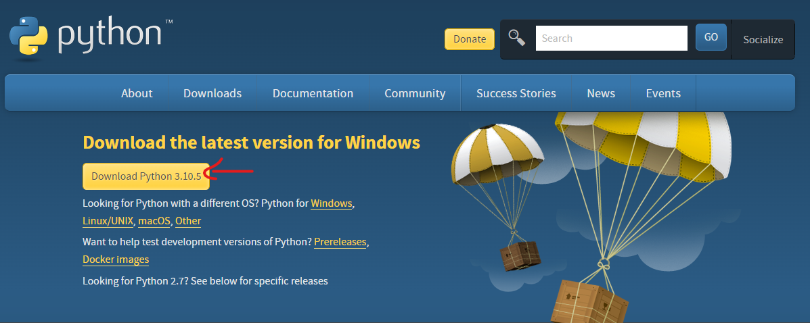
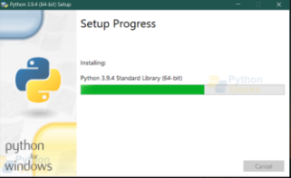
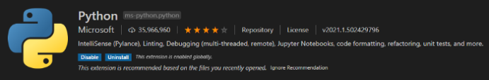
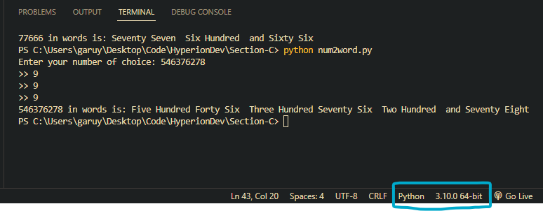
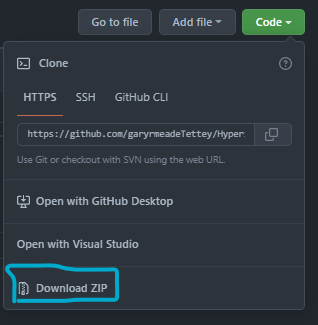
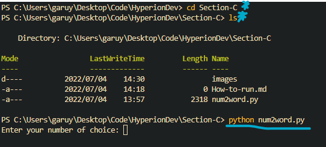

# How to install Python & Run Code on VS Code

## How to install Python

* Go to [https://www.python.org/downloads/].
* Click **"Download Python 3.10.5"**:

* Click **"Install"**.

Allow setup to download and install Python. Follow the instructions.

*Ensure you have the Python extension for Visual Studio Code installed.

*Check the compiler version is correct.

*Once the installation is complete, you can download the code from github.

*Once you have the code, you can run it in the terminal using the **cd** & **ls** commands to navigate your file system on windows [These differ for Mac&Linux].
